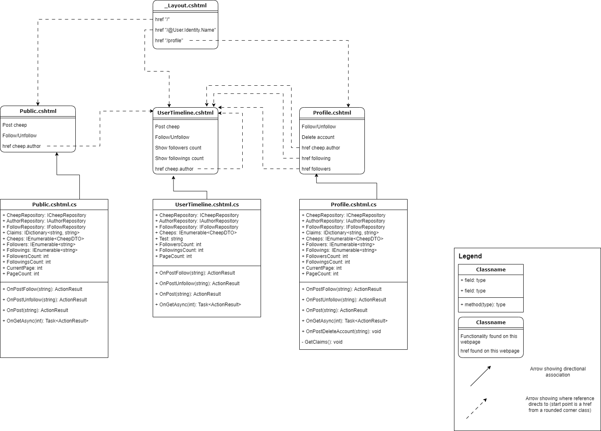
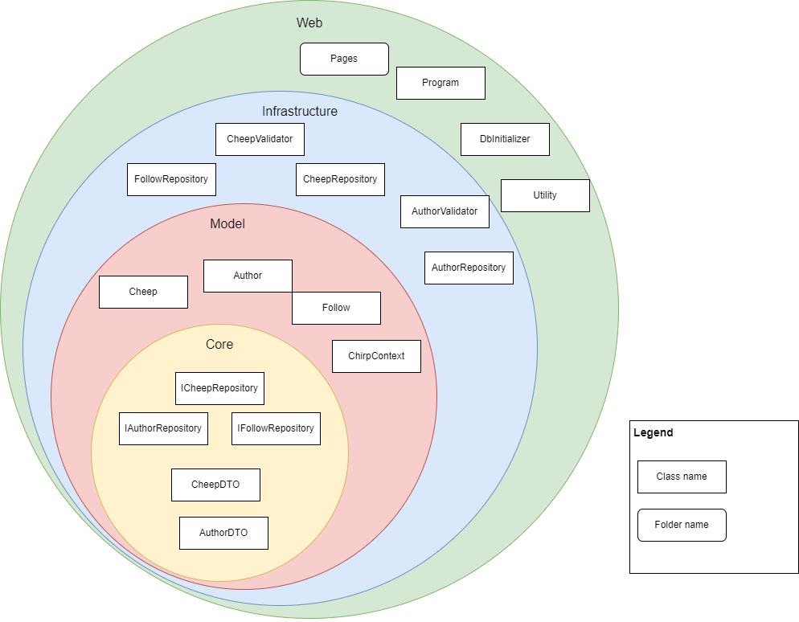
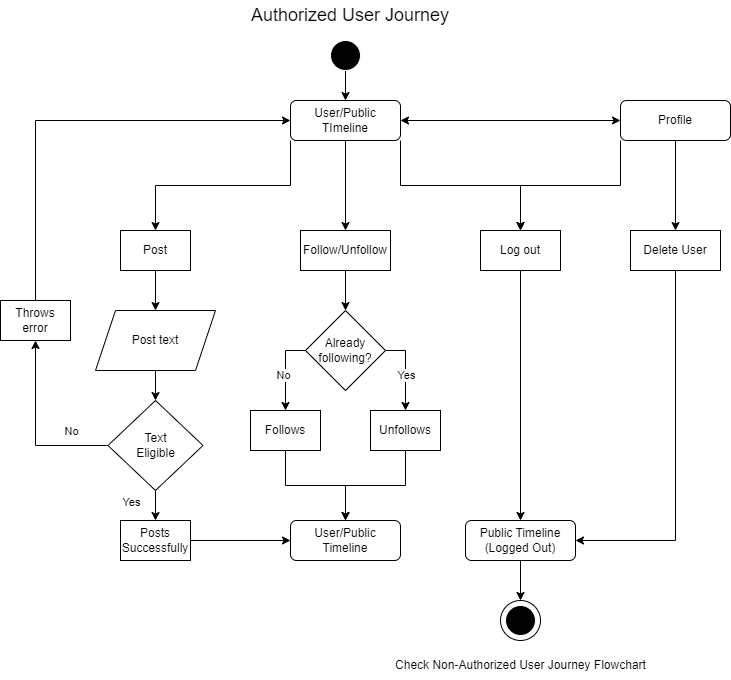
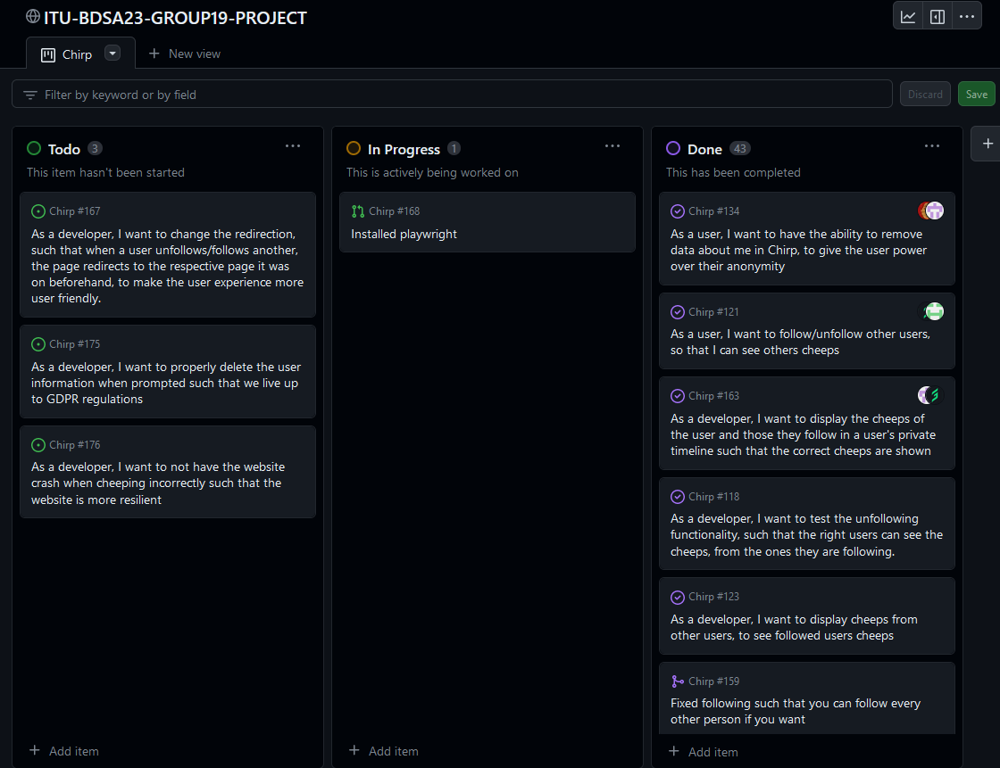

# Introduction

This is a report gives an overview of the work behind our Chirp application made by Group 19 in terms of the final project. This is related to the course Analysis, Design, and Software Architecture during Autumn 2023, with the course code BSANDSA1KU. This overview is given through the chapters Design and Architecture, Process, and Ethics.

# Design and Architecture of _Chirp!_

## Domain model

Below is a domain model of our Chirp application. All classes are shown and an overview of how they interact with each other.

In the general domain model, we do not go into the specifics of how the razor pages are set up and reference each other. That is however shown in detail in the model below. Methods and fields are added as well.

To zoom in on one of the important parts of our program we have created an ER-diagram of how the Author, Cheep and Follow class are related. This is shown below.

## Architecture — In the small

Above is the general architecture of the Chirp application shown as layers in an onion structure. Here is four layers shown although our code only reflects three. We have detached a part of the Infrastructure layer and shown it as the Model layer. This is because our code effectively works this way - there are no dependencies going from the Model layer to the Infrastructure layer, and thus the dependency rule of the onion architecture is upheld.

## Architecture of deployed application

The Client communicates to the azure server and requests and sends datato its database. When Logging in or registering a user, the server will use a third party software via its Tenant.

## User activities

When the program starts, the user will be in the public timeline as a guest. Here the user have two different choices of what they can do: Login/Register or change page. Login/Register takes the user to the same page, here the user can sign in via Github or just with their Email. When changing page the user stays at Public Timelines.

When authorized the user starts in the public timeline, from here they can interact with the navigation tab and main page below. In the navigation tab the user can move to their own timeline, see their profile and logout. From their Profile they can see various information related to them being stored on the side and with the choice to delete all data about them and then log out. In the main page below, the user can see messages of themselves and others, Cheep (Post) new messages and follow/unfollow other users. The cheep will only post if its amount of characters is between 1-160, otherwise it throws an error (\* currently the program doesn't catch this error, so it crashes instead). When pressing follow, the user follows the pressed user and if the user is following they can unfollow instead.

## Sequence of functionality/calls trough _Chirp!_

Below is a UML sequence diagram that illustrates the flow of messages when a user sends an HTTP request to our application. The methods that are called are named, and tthe responses are shown as well. At the end of the flow the fully rendered webpage is returned to the user and the Public Timeline is shown.

## Missing Features & Bugs

While we have been able to incorporate most of Chirps intended features, we find it important to highlight its missing elements and the bugs that remain.

### Viewable Profiles

It remains that the Profile a given user has is only viewable by the user themself. If the user wants to view another user's profile, the user will simply be redirected to the timeline of the given user. As such, when entering a users profile, it looks almost identical to the timeline page, with the exception of the Followers and Following information. This is a bit atypical to the usual profile page, which usually has more customization (e.g. profile pictures, a status, etc.). It remains that a separate user profile does exist, but whether or not it fits the criteria of a normal profile is up to the individual.

### Ability to See Information Kept By Chirp

As of now, the user information is displayed under Profile -> My Information section for a user that is logged in. However, it is not explicitly stated that this is the data kept by Chirp itself. This omitted transparency does not give the user a clear indication that this information is saved and used. In hindsight, this would be changed to be explicitly stated within the My Information box, and thus conform to GDPR regulations.

### Forget Me Feature

When deleting an account, the user merely gets removed from all three separate repositories: AuthorRepository, CheepRepository, and FollowRepository. The caveat, however, is that the personal information related to the user is still kept in our Azure B2C Tenant. This information includes the claims from the B2C Sign Up and Sign In user flow: Display Name, Email Addresses, Given Name, and Identity Provider Access Token. Hence, the user information is not completely removed, and should this application go into commercial use, it'd be essential to implement deletion fully in terms of GDPR laws and ethics.

### Bugs

#### Improper Redirects

In terms of user experience, when choosing to follow and unfollow a given user, the original user will always be redirected back to the first page of cheeps. This is a minor detail, but for regular user usage with enough repetitions, it might cause more annoyance. Should the user try to follow multiple people based on their cheeps from a given webpage, they would have to go back, and find the original cheep of user again.

#### Time and Place for User Authentication

This is more of a situational bug, and as such, only something noticeable when a specific chain of events happen. Should the user delete their account, not only will logging in again happen without having to re-register (given the problem with account deletion highlighted in the Forget Me Feature chapter), but the user will not be registered in our database, until they choose to either cheep or follow someone. This could be fixed by letting a user be registered in the database upon sign up, rather than when an interaction is done with the website.

#### Errors of Cheeping

Currently when a Cheep is posted, it only checks whether or not the cheep is within the correct parameters, i.e. there is text and there is below 160 characters. However, when posting an empty cheep, or a cheep that exceeds the character limit, the website crashes. To combat this issue, we'd implement an if-else statement, that displays an error messages when either scenario takes place.

# Process

## Build, test, release, and deployment

Here are three diagrams representing each of our workflows: Build and Test, Release, and Deploy.

Illustrate with a UML activity diagram how your Chirp! applications are build, tested, released, and deployed. That is, illustrate the flow of activities in your respective GitHub Actions workflows.

Describe the illustration briefly, i.e., how your application is built, tested, released, and deployed.

## Team work

 The tasks that are still unresolved is handling the proper redirection when following/unfollowing a user. This has been discussed in the Missing Features & Bugs chapter under the Improper Redirects section. The Playwright issue was made before the decision to, due to the time until deadline, simply use integration tests instead.

Our typical flow when it comes to adding new features, was to first write an issue. If the feature was from our weekly project work, we would base the description and acceptance criteria on that. We then added the issue to the project board and when someone started working on the issue, they assigned themselves to it and moved it to "In Progress".

Then it came to the implementation itself. We would usually be two or three people working together, and after we learned about pair programming, we began doing it that way. How long it took to make varied greatly. When we had problems, we would frequently look up guides or consult a TA. When the feature was finished, we would always make sure that it worked locally before pushing it to main.

Our commit graph is not equal but there can be several different reasons for this, such as a member being sick or spending a lot of time working on Azure, especially because we ran out of credits and had to do it again. The frequency at which each person commits also varies, as some people commit a lot while working on a feature, while others do it less, so that also has an influence.

## How to make _Chirp!_ work locally

These are the following prerequisites:

- .NET 7
- Docker Container

Follow these steps to open Chirp locally:

1. Use these respective properties for instantiating the Docker Container:
   1a. Password: Y0waddup
2. Open Docker and Instantiate the local database container by running this command: 'docker run -e "ACCEPT_EULA=Y" -e "MSSQL_SA_PASSWORD=yourStrong(!)Password" -p 1433:1433 --name sqlpreview --hostname sqlpreview -d mcr.microsoft.com/mssql/server:2022-latest', and type in the password from step 1 where <yourStrong(!)Password> is.
3. Open Docker and run the container.
4. Clone the 'https://github.com/ITU-BDSA23-GROUP19/Chirp' repository onto your workspace. This could be your desktop, a folder you find appropriate, or a third place.
5. Wherever you have cloned the repository to, you should now see the given repository as a folder called Chirp.
6. Open either a terminal in the respective folder through a general terminal like PowerShell or a code editor of choice, and then a terminal within.
7. In either terminal, navigate to the ~/Chirp/src/Chirp.Web/ folder.
8. In either terminal, run the "dotnet run" command.
9. You should now see a 'Building...' syntax, and the respective queries being executed.
10. In your terminal, you should now be able to find a syntax like this: "info: Microsoft.Hosting.Lifetime[14]
    Now listening on: https://localhost:7102".
11. Go to https://localhost:7102 in your browser, and see the Chirp app.

## How to run test suite locally

These are the following prerequisites:

- .NET 7
- Docker Container

Follow these steps to test Chirp locally:

1. Use these respective properties for instantiating the Docker Container:
   1a. Password: Y0waddup
2. Open Docker and Instantiate the local database container by running this command: 'docker run -e "ACCEPT_EULA=Y" -e "MSSQL_SA_PASSWORD=yourStrong(!)Password" -p 1433:1433 --name sqlpreview --hostname sqlpreview -d mcr.microsoft.com/mssql/server:2022-latest', and type in the password from step 1 where <yourStrong(!)Password> is.
3. Open Docker and run the container.
4. Wherever you have cloned the repository to, you should now see the given repository as a folder called Chirp.
5. Open either a terminal in the respective folder through a general terminal like PowerShell or a code editor of choice, and then a terminal within.
6. In either terminal, navigate to the ~/Chirp/ folder.
7. Run the 'dotnet build' command.
8. You should now see the respective projects being restored and built.
9. Run the 'dotnet test' command.
10. You should now see the respective tests being run on each project and the results of them.

### Test Suite Tests

This is a brief overview of what kinds of test we have in our test suites and what they are testing.

#### Failed Tests

When running the test suite locally, it should be highlighted that some test will fail. They all are regarding the timestamp of cheeps. The reason they fail is that the strings differ in terms of timestamps, i.e. the expected string is "... 13:15:25", but the actual value is "...13.15.25". We have made the decision to keep these, since changing them will cause the tests to fail on GitHub instead. We have prioritized the tests on GitHub, rather than the local testing.

####Chirp.Core.Tests

The Chirp.Core tests consists of unit tests. The unit tests are for the creation of the AuthorDTO and CheepDTO objects. The AuthorDTO tests checks whether or not it is possible to create an AuthorDTO object, and the CheepDTO tests checks similarly if it is possible to create a CheepDTO.

#### Chirp.Infrastructure.Tests

The Chirp.Infrastructure tests consist unit tests matching AuthorRepository, CheepRepository and FollowRepository tests. Each repository gets tested for whether the repositories function as intended. For example, for the AuthorRepository, it tests whether or not it is possible to create the repository itself, to find an existing Author in the repository, that you can't have Authors of the same name, to create or delete an Author in the repository, and to find a non-existing Author in repository.

#### Chirp.Web.Tests

The Chirp.Web tests consist of integration tests. They each test the way our app functions, i.e. whether or not it is possible to see the timelines themselves (both private and public), and to see the first page on either timeline correctly.

# Ethics

## License

We have chosen to use the MIT Lisence, since we wanted a license which allowed commercial use and the modification and distibution of the software. Therefore we chose a permissive license that allowed those properties and therefore we ended up with the MIT Lisence.

We have also check all of the external libraries which we have used, if our license comes in conflict with their licenses. As far as we can see all of the libraries uses MIT Lisence which does not conflict our license. But the library FluentValidation uses Apache License Version 2.0 which might come in conflict with our license.

## LLMs, ChatGPT, CoPilot, and others

During the development of this project, we have at times used ChatGPT to figure out why the code was not working as we thought it would or how to fix functionality that did not work as intended. ChatGPT has been good at detecting where the faults have been and what we might need to change but actually doing the change and creating a solution was a bigger challenge for the LLM. Mainly we have used the information about the mistakes to further research for more in depth explanations of the APIs or method calls we have used. This way we created the solution ourselves but ChatGPT helped us understand where the problem was.
